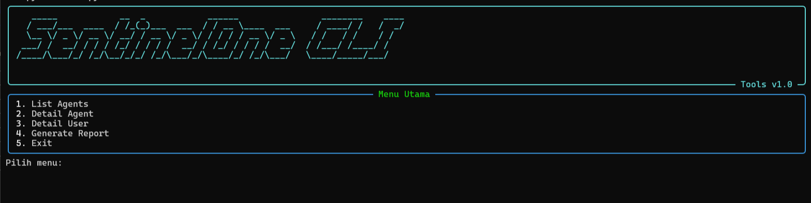
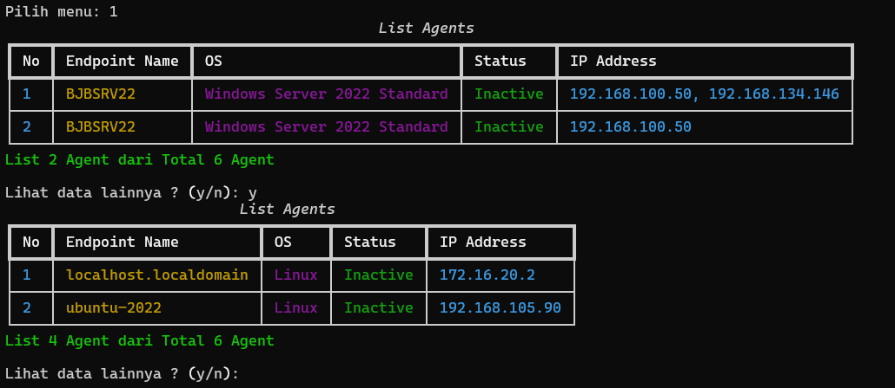
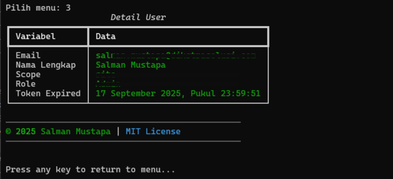

<div align="center">

```
 ██████╗██╗     ██╗
██╔════╝██║     ██║
██║     ██║     ██║
██║     ██║     ██║
╚██████╗███████╗██║
 ╚═════╝╚══════╝╚═╝ 

Mini App Menggunakan Terminal Linux 
Monitoring SentinelOne
```
---

  [](https://github.com/salman-mustapa/miniapps-cli-sentinelone/stargazers)
  [](https://github.com/salman-mustapa/miniapps-cli-sentinelone/fork)
  [](https://github.com/salman-mustapa/miniapps-cli-sentinelone/graphs/contributors)
  [](https://github.com/salman-mustapa/miniapps-cli-sentinelone/issues)
  [](./LICENSE)


</div>

---

## 🚀 Tentang Project
`SentinelOne Mini CLI` digunakan untuk melakukan monitoring [SentinelOne](https://sentinelone.com) menggunakan terminal linux, dibangun karena keresahan terkait dengan authentikasi 2FA ketika login.

---

## ✨ Fitur
- 📊 **List Agents** dengan tabel bergaya (`rich`).
- 🔄 **Pagination** otomatis → bisa lanjut lihat data selanjutnya.
- ⚡ **Fast & Simple**: cukup API token + URL base.
- 🎨 Tampilan CLI modern ala hacker.

---

## 🛠️ Instalasi

1. Clone repo ini:
   ```bash
   git clone https://github.com/salman-mustapa/miniapps-cli-sentinelone.git
   cd miniapps-cli-sentinelone
   ```
2. Install dependency:
    ```bash
    pip install -r requirements.txt
    ```
3. Jalankan aplikasi
    ```bash
    python main.py
    ```

---
### 🤝 Kontribusi
1. Fork repository ini
2. Buat branch baru (feature/nama-fitur)
    ```bash
    git branch feature/create-user
    ```
3. commit dan push
    ```
    git add .
    git commit -m "feat: add feature create user"
    git push -u origin feature/create-user
    ```
## 📸 Screenshots  

| Tampilan | Preview |
|----------|---------|
| Menu   |  |
| List Agents     |  |
| Detail User |  |
